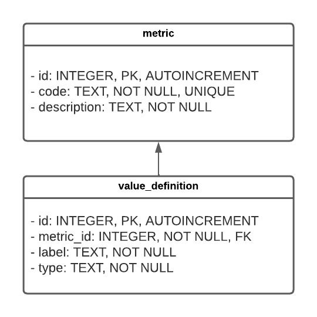

# Novisto Backend Test

## Overview

This is a simple software with a CSV file in `backend/resources/metrics.csv` that is used to feed a SQLite3 
database located at `backend/db/test.db`. We want to complete the DB schema, we want to make a function that will fill 
the database from the CSV, then we want to make APIs to consume the data from the DB.

This test is not made to be complex, this is a take-home test and you are given a few days to complete it at your 
leisure. This test can be completed fairly quickly, the level of finish you decide to put in it is up to you. Keep 
track of the time you spend on the test as we will discuss your test results based on the level of finish against the 
time you spent on it. If you finish fast and provide the minimum requirements that's fine, if you prefer to go over 
expectations and take longer that is fine too. Both are acceptable results for this test.

If you encounter issues or if you have questions don't hesitate to reach out by e-mail to alexandre.jutras@novisto.com.

## What do you need to do? 

Your solution must run with python 3.6+ or higher. There are three steps to perform:

1. Complete the database schema. The table `metric` has been created, but it's missing the other table: 
   `value_definition`. You can refer to the database schema image included to know what the expected table is supposed 
   to look like. How you complete the schema is up to you, you can do it through code or through a straight SQL 
   statement. Conceptually a Value Definition is a component of a Metric, a Metric can have one 0 to N Value Definition 
   attached to it. You can think of a Metric as a meta question and Value Definition as specific single element 
   question related to the meta question.
   **Tip**: Look at the data to get a clear idea of how the two tables are related.
   
The database schema:
   
   

The SQLite3 database `backend/db/test.db` is provided as a jumping point but if SQLite3 is not your cup of tea feel 
free to use MySQL or Postgres. If you decide to do so, make it abundantly clear in your documentation, use a docker 
container for your DB and leave instructions on how to get setup. Keep in mind you will need to recreate the metric 
table in this case since you won't be re-using `backend/db/test.db`.

2. Create a function to load the CSV into the database. The CSV represent both tables on each line, this mean that 
   there are repetition in column `metric_code` and `metric_description`. The CSV represent two different metrics 
   (`TB-001` and `TB-002`) with 2 and 3 value definitions respectively. Your function need to be idempotent, if you 
   run it twice in a row, it should not create duplicated rows.
   
3. Install a web framework of your choice (ex: Flask, FastAPI, Bottle, etc.) and make one or more web API endpoint 
   route(s) that read the content of the database and display it. This step is left to be fairly open in terms of 
   requirements, we want to see what you will do. You decide what the route(s) will look like, what and how you are 
   going to read from the DB and what kind of output structure you want to provide, we only require that your route(s) 
   return JSON.

## Delivery & Documentation

Add any python libraries needed to run your project to the requirements.txt file, you should be able to do so easily 
with command `pip freeze > requirements.txt`. Keep your requirements.txt clean of only what is needed to run your 
project. If you want to use something better than straight pip and want to plug poetry or pipenv, feel free to do so.

**Documentation is part of the evaluation.** You need to deliver documentation for your solution, either directly in 
the e-mail reply that contain your solution or as a text file clearly identified in your project. Be accurate in your 
documentation as we will want to run both your import CSV function and your API endpoint(s) as part of your evaluation.
The following elements need to be part of your documentation:

1. How did you complete the DB schema. You need to at least provide a SQL statement.
2. How to import the CSV to the SQL database. Document the entry point in your software to do so.
3. How to start your web framework, document the entry point in your software to do so.
4. How to call your API endpoint to read the database and show the result of your route(s). Document your route(s).
5. Any additional documentation you wish to provide or is required to run your project.

Zip your project and send it as an e-mail attachment to alexandre.jutras@novisto.com. **Make sure your e-mail includes 
your full name as well as the time you took to complete the test**. You will get an answer within the next few work 
days. 

Thank you and we wish you the best of luck. 
